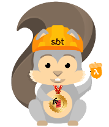

# sam-cloudwatch-seed.g8
A template project for quickly creating CloudWatch event handlers.

For more information see [sbt-sam](https://github.com/dnvriend/sbt-sam)

## Usage
Create a new template project by typing:

```
sbt new dnvriend/sam-cloudwatch-seed.g8
```

## Usage
- To deploy the project type `samDeploy`
- To remove the project type `samRemove`
- To get deployment information like available endpoints and stack information, type `samInfo`

## Event Handler Configuration
Lets create the following event handler for the CloudWatch event source:

```scala
@CloudWatchConf(
  pattern =
    """{
    "source": [
      "aws.codebuild"
    ],
    "detail": {
      "build-status": [
        "FAILED"
      ],
      "project-name": [
        "SBT-SAM"
      ]
    }
  }""")
class CloudWatchLambda extends CloudWatchEventHandler {
  override def handle(event: CloudWatchEvent, ctx: SamContext): Unit = {
    println(s"Triggered by the following CloudWatchEvent: '$event'")
  }
}
```

Have fun!